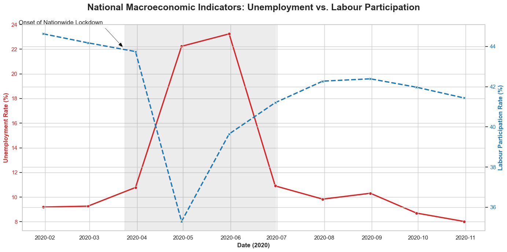
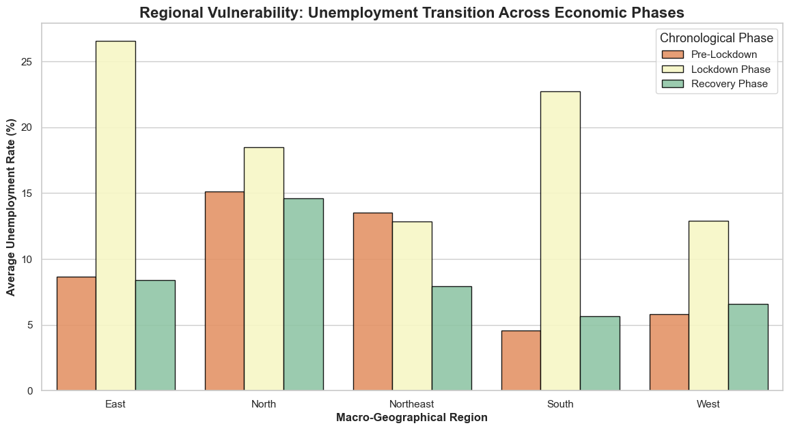
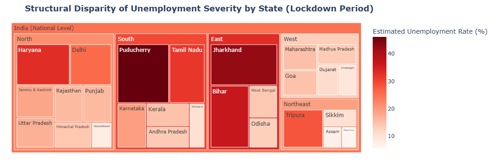
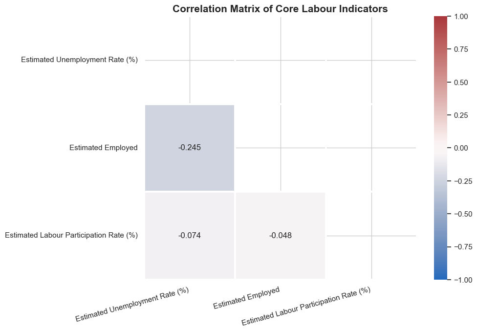
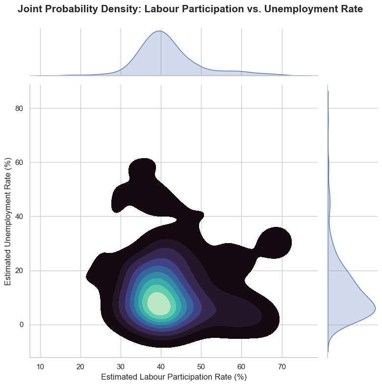

# CodeAlpha Unemployment Analysis with Python

This repository contains an analysis of the unemployment rate in India, focusing on the impact of the COVID-19 pandemic. The project involves data cleaning, exploratory data analysis (EDA), and data visualization to identify trends and patterns in the labor market.

## Project Structure

- `app.ipynb`: Jupyter notebook containing the full analysis, data processing, and visualizations.
- `README.md`: Project documentation.
- `graphs/`: Contains extracted visualizations from the notebook.

## Visualizations and Insights

The analysis generates several key visualizations to understand the unemployment landscape. Below are the graphs extracted directly from the notebook detailing unemployment trends, regional analyses, and feature correlations:

## Requirements

- Python 3.x
- Pandas
- NumPy
- Matplotlib
- Seaborn
- Plotly

## Usage

1. Clone or download the repository.
2. Open `app.ipynb` using Jupyter Notebook or JupyterLab.
3. Run the cells to reproduce the analysis and view the generated graphs interactively.
